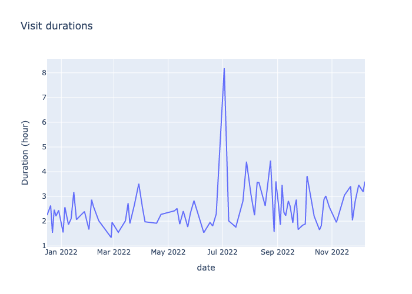
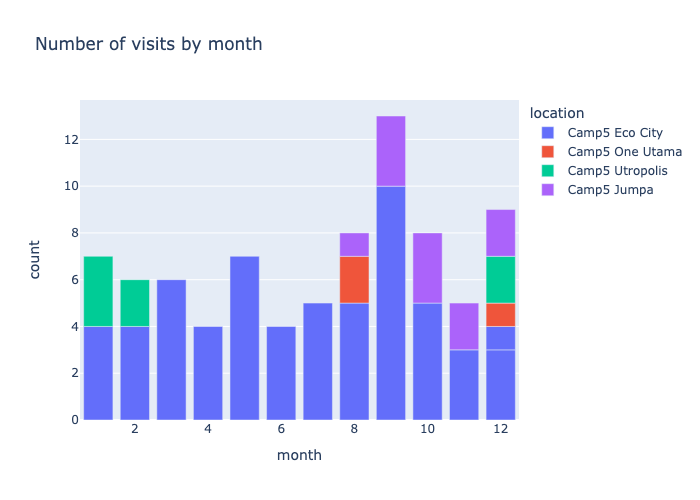

# README

Parse data from Camp5 membership page and put into graph. Data taken from one of the XHR/Fetch requests done when accessing https://camp5.com/member/ page.

1. Select a previous membership term from the drop down
2. Click on 'View Details'
3. Check the XHR/Fetch requests in your browser network tab. There should be one with this data in JSON.

## Example Result

### Visit Duration stats

```
min              0 days 01:20:14
max              0 days 08:11:08
mean   0 days 02:30:54.304878048
sum              8 days 14:14:13
```



